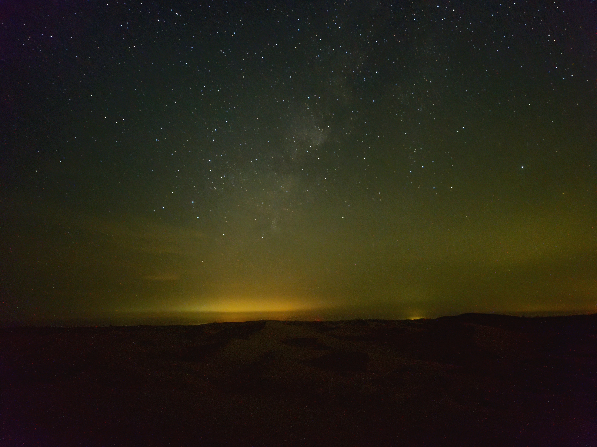

# Anwa - the dark sky of Al Qua'a, measured and bookable

**Anwa turns Al Qua'a's dark night sky into a bookable, AI-guided, heritage-rooted experience that local camel-farming families can host and earn from, and it proves and protects the darkness with real data.**

Tatweer hackathon entry, **Challenge 5 (free choice / open lane)**.

## The problem

Al Qua'a sits under one of the darkest skies in the country: a Bortle 2 sky where the Milky Way is visible to the naked eye, about 33 times darker than Dubai's. It is a rare, world-class natural asset, and it earns the people who live beneath it nothing.

The families here depend on camel farming as a single, fragile income. The dark sky above them, the one thing they have that the cities have already lost, brings in nothing at all. And no one is guarding it: there is no record of how dark it is, no way to prove it to anyone, and light pollution is creeping out from the coast year on year. A dark sky is a resource you only lose once, and there is no getting it back. Right now Al Qua'a is quietly losing a world-class one, with nothing to show for it and no one watching.

So the problem has three edges at once: a community with one fragile income, a rare asset earning them nothing, and that asset shrinking while it is unmeasured and unprotected. Anwa is built to turn all three around: prove the darkness with real data, make it a night people travel and pay for in the families' hands, and keep the first running record of whether this sky is slipping.

The name **Anwa** (أنواء) is the old Bedouin star-calendar system: reading the heliacal risings of stars to know the seasons, the weather, and the rains. The platform's planner is a modern, computed version of exactly that.


*Long exposure. Al Qua'a, UAE. Team original. The Milky Way core and green airglow are visible to the naked eye here; the orange band low on the horizon is distant light pollution, the exact thing this platform monitors.*

▶ **See it working:** [product walkthrough video](media/anwa-demo.mp4) · [concept film](media/anwa-film.mp4) · run it yourself with the steps in section 9.

---

## 1. The community, and why this is built for Al Qua'a

Al Qua'a is a rural community near Al Ain, UAE. Three facts make it the right place and shape the whole platform:

- It sits on the **Tropic of Cancer** (23.44 N), so the Milky Way core climbs to about 37 degrees, unusually high and near-upright.
- Most families run **camel farms as a single income source**, and hold dark desert land with no second income.
- It has **some of the darkest skies on Earth**, a rare shared natural asset that is currently unmeasured and unprotected.

## 2. The demographic

Camel-farming families and landowners in Al Qua'a who hold dark desert land but no second income, plus the wider community whose night sky is an unprotected shared resource. They have the land, the hospitality, and the heritage knowledge; what they lack is a way to prove the asset, find guests, and guide visitors who do not speak Arabic.

## 3. The solution - four connected modules

A single Next.js app. Each module is real and works end to end.

| # | Module | What it does |
|---|--------|--------------|
| 01 | **The Proof** (`/proof`) | Darkness measured against the cities with real figures, units and sources, a keyless map with pin-drop sampling, and the team's own on-site photographs as first-party evidence. |
| 02 | **The Planner** (`/planner`) | Ranks upcoming nights from real astronomy (moon phase, twilight, Milky Way core altitude, planets, the meteor calendar). Renders an accurate star chart and a sky clock. Every raw value is shown for verification. No LLM is used here, on purpose. |
| 03 | **The Guide** (`/guide`) | Generates a full guided tour in any language, grounded in real Arab and Bedouin star lore, so an Arabic-only host can guide international guests. Ships a committed English and Arabic sample so it works with no API key. |
| 04 | **Host & Book** (`/book`) | Families list a desert site and take bookings tied to the Planner's good nights. Full booking lifecycle: request, confirm, decline. Persists in SQLite. |

The modules connect: the Planner feeds the Booking availability, and a chosen night flows into both the star chart and the Guide.

### Where AI earns its place

AI is used only where it genuinely adds value, always grounded in the real astronomy and the curated heritage data, never to invent facts. Every feature degrades gracefully without an API key.

- **The Guide** generates and translates a full guided tour into any language, grounded in the curated Arab and Bedouin star lore. Ships committed English and Arabic samples for the no-key demo.
- **Ask the Sky** (`/companion`, plus a floating button on every page) is an agentic assistant: it calls real tools (rank the nights, what is up tonight, star lore, the host sites) and answers from real computation rather than guessing. Without a key it still returns a real computed answer.
- **Read my sky** (on The Proof) uses multimodal vision: upload a night photo and it estimates the darkness (Bortle class), what is visible, and the light pollution, then compares it with Al Qua'a. Works on the team photos with no key; live vision on uploads with a key. This turns every visitor's phone into a citizen-science darkness sensor.
- **Spoken tours**: the Guide reads the tour aloud in the chosen language using the device's own voice. No key, works offline, so an Arabic-only host can literally press play.
- **Your-night keepsake** (`/keepsake`): a shareable card of the real sky on a guest's night with a short grounded story, downloadable as an image.

## 4. Impact, with testable claims

Every claim below is filled with a real computed or sourced value, and can be checked.

- **"Al Qua'a sky brightness is 21.8 mag/arcsec2 (Bortle 2), versus Dubai at 18.0 (Bortle 8), about 33 times darker."** Source: Falchi et al. 2016 and the Bortle scale. See `/proof`.
- **"The next optimal stargazing window is around the 14 July 2026 new moon, with the best night (12 July) under 4 percent moon illumination, the Galactic Centre at 37.5 degrees."** Computed from ephemeris, committed in `data/sample-window.json`, reproducible with one command. See `/methods`.
- **"These are real long-exposure captures from Al Qua'a: the Milky Way core and natural airglow are visible to the naked eye here."** See the two photographs on `/proof`.
- **"A non-English-speaking host can run a full guided session, because the tour is generated and narrated by the platform."** See the committed English and Arabic sample tours on `/guide`.

The income impact is direct: four seeded host families list sites at 180 to 300 AED per person, on nights the platform proves are worth travelling for. The asset impact is a measured, monitored, defensible record of the darkness.

## 5. Evidence and methods (falsifiability)

This is wired through the product, not bolted on. The dedicated **Methods and Sources** page (`/methods`) documents the data sources, the libraries, the formulas, and exactly what is **real-measured vs published vs computed vs AI-generated**. In short:

- **Real, measured on site:** the two long-exposure photographs (team originals).
- **Published, cited:** Bortle class per location (Falchi 2016 + VIIRS), the meteor calendar (IMO), star positions (HYG catalogue), Arabic star etymology (standard references).
- **Computed here:** moon phase and illumination, twilight, planet positions, Galactic Centre altitude and transit, the night score. The mag/arcsec2 figure is derived as the midpoint of the standard published range for each Bortle class, and is labelled as derived, not as a sensor reading.
- **AI generated:** only the narrated tour, and only when a key is present. The model is grounded in the curated heritage dataset and instructed not to invent lore. No other figure on the platform is AI generated.

Every darkness figure on `/proof` shows its raw number, unit and source. Every ranked night on `/planner` shows the ephemeris values behind it so you can check them against Stellarium or timeanddate.

Primary sources: [Falchi et al. 2016, Science Advances](https://doi.org/10.1126/sciadv.1600377) · [VIIRS DNB](https://eogdata.mines.edu/products/vnl/) · [Bortle scale](https://skyandtelescope.org/astronomy-resources/light-pollution-and-astronomy-the-bortle-dark-sky-scale/) · [IMO meteor calendar](https://www.imo.net/resources/calendar/) · [HYG database](https://github.com/astronexus/HYG-Database).

## 6. Feasibility and cost

Built to run on free data and a phone.

- **Data:** Falchi, VIIRS, Bortle, the IMO calendar and the HYG catalogue are all free. `astronomy-engine` is MIT and dependency-free.
- **Map:** MapLibre GL with keyless CARTO dark basemap tiles. No map API key, no map bill.
- **Database:** SQLite, a single local file. Nothing to provision for the demo.
- **AI:** the only paid call is the Guide, server-side. A tour is a few thousand tokens, so the order of cost is cents per generated tour, and a host can save and reuse a tour for zero cost. With no key the platform still runs and serves the committed sample.
- **Hosting:** deploys to Vercel's free tier. The whole thing runs from a host's phone in the desert.

## 7. Scalability

The platform replicates to **every dark rural community**, not just Al Qua'a.

- The astronomy, the star chart, and the scoring work for **any coordinates on Earth**. Point them at a new village and the Planner just works.
- The Proof generalises by adding that region's published darkness values and photographs.
- The heritage dataset is swappable: a different culture's star lore drops into `data/stars.ts` and the Guide narrates it.
- **Production swaps:** change the Prisma provider from `sqlite` to `postgresql` and set `DATABASE_URL` (Vercel Postgres, Neon or Turso) with no code change; add Stripe for real payment; add host authentication; add a live light-pollution tile layer to the map for true per-pin sampling.

## 8. How to run and verify

Requirements: Node 20+.

```bash
# 1. install
npm install

# 2. environment (the key is optional; the app runs without it)
cp .env.example .env

# 3. database: create the SQLite file and seed Al Qua'a hosts and good nights
npm run db:reset

# 4. run
npm run dev
# open http://localhost:3000
```

`.env` keys:

- `ANTHROPIC_API_KEY` - optional, and one key powers all the live AI: the Guide (tours in any language), Ask the Sky (the companion), Read my sky (photo vision), and the keepsake story. Get a key at console.anthropic.com. Without it the app still runs everywhere: the Guide serves a committed sample, the companion returns a real computed answer, Read my sky works on the team photos, and the keepsake uses a templated story. Spoken tours and the map never need a key.
- `ANWA_GUIDE_MODEL` - the model the Guide uses (default `claude-opus-4-8`).
- `DATABASE_URL` - the SQLite file (default `file:./dev.db`).

**Verify each flow:**

- **Proof:** open `/proof`, read the 33x figure and its source, click the map to drop a pin and see the nearest reference darkness, scroll to the two on-site photographs.
- **Planner:** open `/planner`, pick a night, drag the time scrubber and watch the chart change, read the raw values, then check them in Stellarium or timeanddate set to Al Qua'a (23.52 N, 55.49 E). The moon phase, twilight and core altitude will match.
- **Guide:** open `/guide`, switch between English and Arabic to see the committed tour render right to left, and read how it was grounded. Add a key to generate live for any night and language.
- **Book:** open `/book`, open a site, request a night, then open `/book/host#console` to confirm or decline that request.

**Where the committed sample output lives:**

- `data/sample-tour.json` - the pre-generated English and Arabic guided tour.
- `data/sample-window.json` - the pre-computed next optimal window. Regenerate with `npx tsx scripts/generate-sample.ts`.

## 9. Tech and architecture

- **Next.js (App Router) + React + TypeScript.** Route handlers keep the Anthropic key server-side.
- **Tailwind CSS**, fully custom theme (airglow-green palette, Fraunces / Spectral / IBM Plex Mono).
- **astronomy-engine** for all ephemeris.
- **MapLibre GL JS** for the keyless map.
- **Custom SVG star chart** fed by a stereographic projection of `astronomy-engine` and HYG positions; the Milky Way band is drawn from the galactic plane.
- **Prisma + SQLite** for persistence.
- **Anthropic SDK** server-side for the Guide, with a graceful no-key fallback everywhere.

```
app/            routes and API handlers (proof, planner, guide, book, methods)
components/     StarChart, ProofMap, PlannerView, GuideView, booking UI, design primitives
data/           stars, darkness values, meteor calendar, HYG catalogue, committed samples
lib/            astronomy engine wrapper, prisma client, guide types
prisma/         schema and seed
scripts/        sample-window generator
public/img/     the two team photographs
```

## 10. Demo video

- **Product walkthrough** (real screen recording of the live app, all four modules and every AI feature end to end): [media/anwa-demo.mp4](media/anwa-demo.mp4)
- **Concept film** (a short atmosphere piece): [media/anwa-film.mp4](media/anwa-film.mp4)

A note on honesty: the two long-exposure photographs (in this README and on The Proof) are real, shot on site at Al Qua'a by the team. The concept film is AI-generated illustration of the setting, not real footage, and is labelled as such.

## License

MIT. See [LICENSE](LICENSE). The two photographs in `public/img` are team originals shot at Al Qua'a and are included for this entry.
